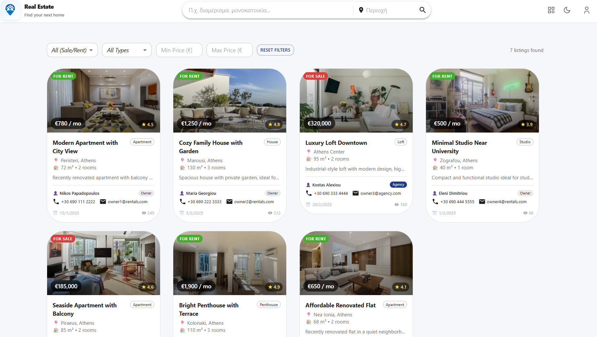
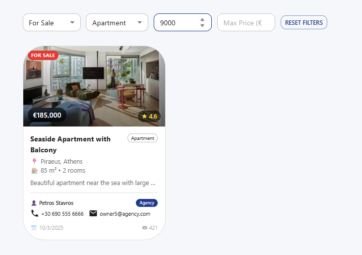
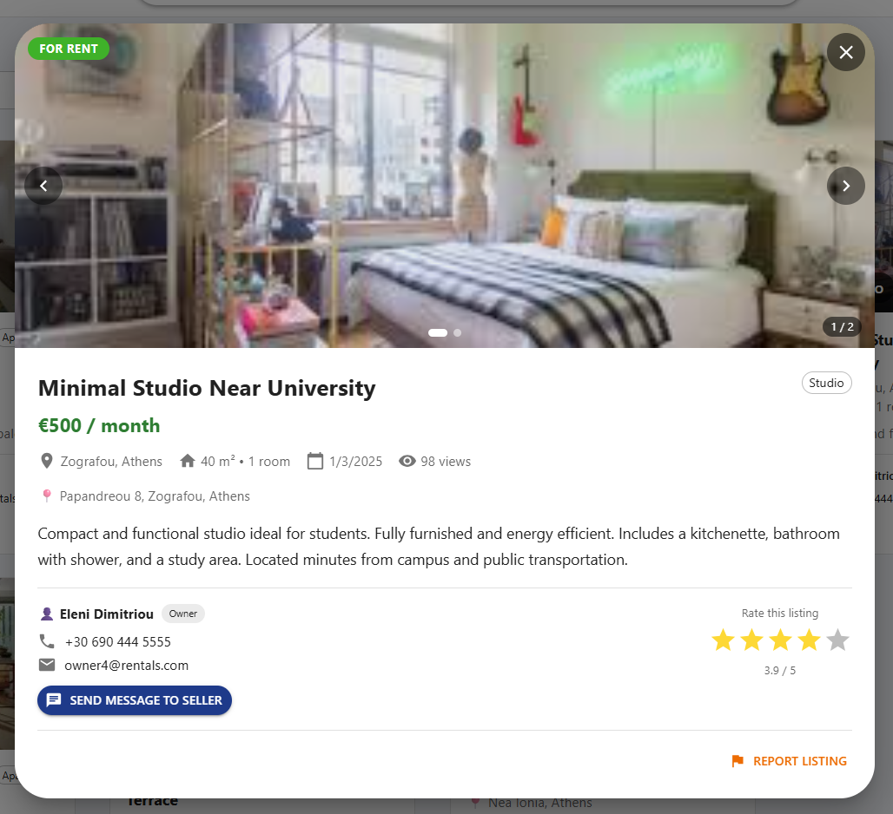
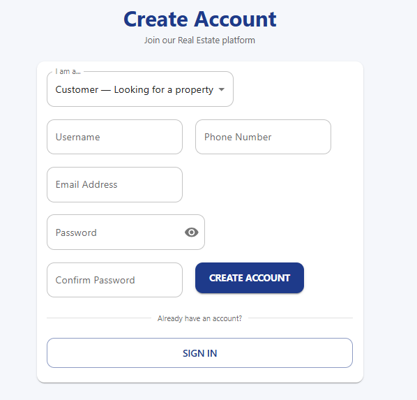
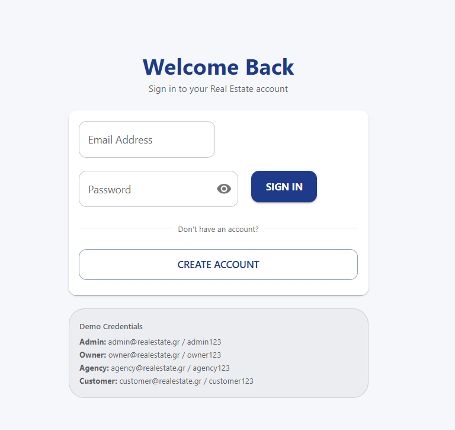
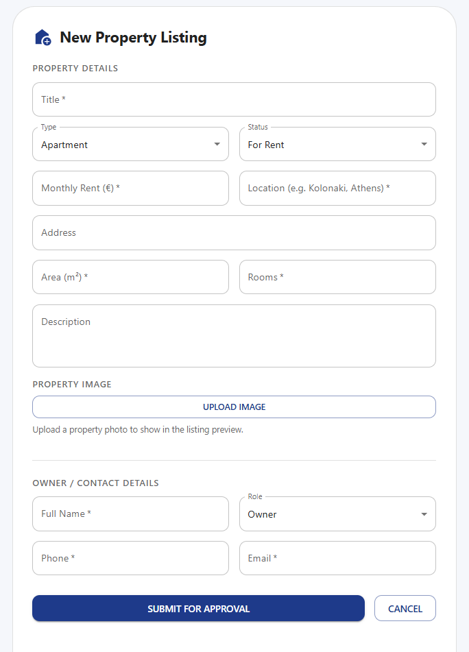
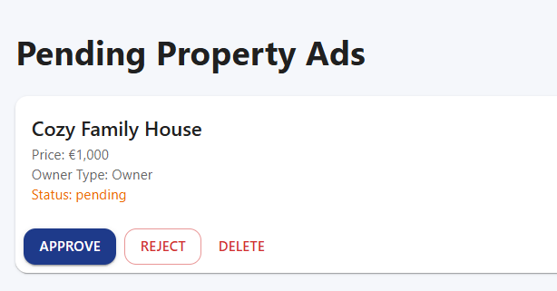
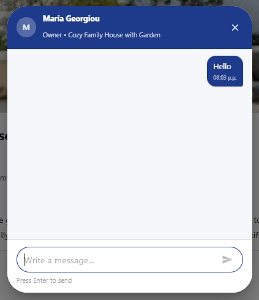
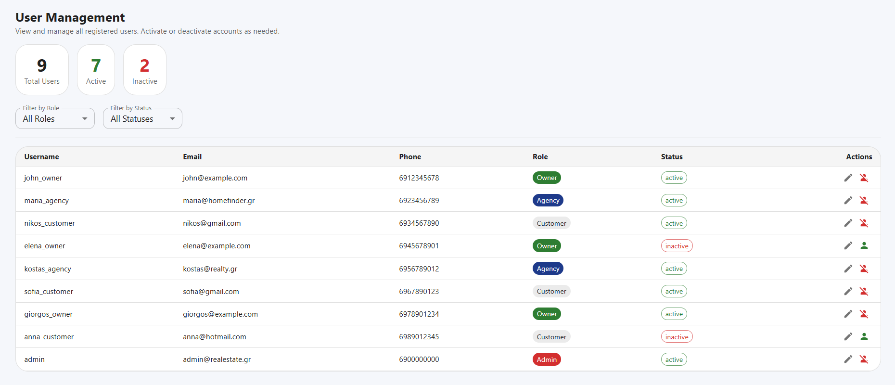
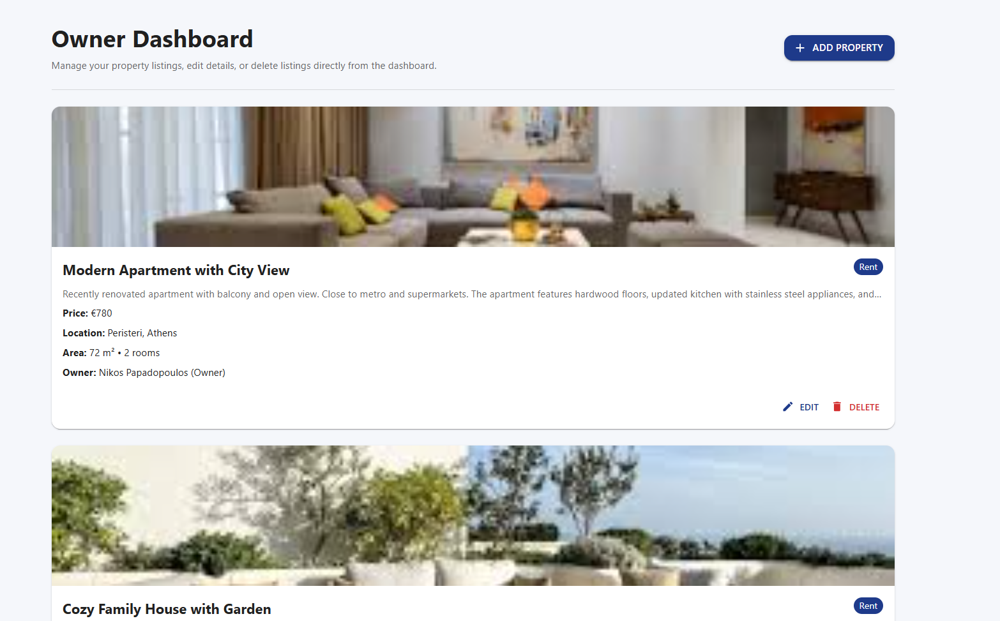

# 🏠 Real Estate App — Ιστοσελίδα Μεσιτικού Γραφείου

> Εφαρμογή διαχείρισης ακινήτων που αναπτύχθηκε στο πλαίσιο του μαθήματος **Ειδικά Θέματα Τεχνολογίας Λογισμικού** με μεθοδολογία **RUP (Rational Unified Process)**.

---

## 📋 Πίνακας Περιεχομένων

- [Σχετικά με την Εφαρμογή](#σχετικά-με-την-εφαρμογή)
- [Tech Stack](#tech-stack)
- [Εγκατάσταση & Εκκίνηση](#εγκατάσταση--εκκίνηση)
- [Δομή του Project](#δομή-του-project)
- [Ρόλοι Χρηστών](#ρόλοι-χρηστών)
- [Use Cases ανά Ρόλο](#use-cases-ανά-ρόλο)
- [Routes & Navigation Guards](#routes--navigation-guards)
- [State Management — Redux Slices](#state-management--redux-slices)
- [Καταστάσεις Αγγελιών](#καταστάσεις-αγγελιών)
- [Τεστ](#τεστ)
- [Εγχειρίδιο Χρήστη](#εγχειρίδιο-χρήστη)
  - [6.1 Σύντομη Παρουσίαση](#61-σύντομη-παρουσίαση)
  - [6.2 Σενάρια Λειτουργίας](#62-σενάρια-λειτουργίας)
- [Screenshots](#screenshots)
- [Ομάδα](#ομάδα)

---

## Σχετικά με την Εφαρμογή

Η εφαρμογή προσομοιώνει ψηφιακή πλατφόρμα μεσιτικού γραφείου. Επιτρέπει σε χρήστες να αναζητούν ακίνητα, σε ιδιοκτήτες και πρακτορεία να δημοσιεύουν αγγελίες, και σε διαχειριστές να εποπτεύουν το σύστημα.

> **Σημείωση:** Η εφαρμογή χρησιμοποιεί **mock data** — δεν υπάρχει πραγματικό backend ή βάση δεδομένων. Όλα τα δεδομένα διαχειρίζονται client-side μέσω Redux store.

---

## Tech Stack

| Κατηγορία | Τεχνολογία |
|-----------|-----------|
| UI Framework | React 19 |
| State Management | Redux Toolkit (RTK) · React Redux |
| Component Library | Material-UI (MUI) v7 · MUI X Date Pickers |
| Routing | React Router v7 |
| Forms & Validation | Formik |
| Icons | MUI Icons · Tabler Icons |
| Date Handling | Day.js · date-fns |
| Drag & Drop | react-draggable |
| Testing | @testing-library/react · Jest |
| Styling | Emotion (CSS-in-JS) |

---

## Εγκατάσταση & Εκκίνηση

### Προαπαιτούμενα

- **Node.js** v18 ή νεότερο
- **npm** v9 ή νεότερο

### Βήματα

```bash
# 1. Αποσυμπίεση του zip και μετάβαση στον φάκελο του project
cd RealEstateApp

# 2. Εγκατάσταση dependencies
npm install

# 3. Εκκίνηση development server
npm start
```

> **Σημείωση:** Ο φάκελος `node_modules` δεν περιλαμβάνεται στο zip — δημιουργείται αυτόματα με το `npm install`.

Η εφαρμογή ανοίγει αυτόματα στο [http://localhost:3000](http://localhost:3000).

### Διαθέσιμα Scripts

```bash
npm start       # Εκκίνηση development server
npm test        # Εκτέλεση test suite
npm run build   # Production build στον φάκελο /build
npm run eject   # Εξαγωγή CRA configuration (μη αναστρέψιμο)
```

### Mock Credentials (για δοκιμή)

| Ρόλος | Username | Email | Password |
|-------|----------|-------|----------|
| Admin | admin | `admin@realestate.gr` | `admin123` |
| Owner | john_owner | `owner@realestate.gr` | `owner123` |
| Agency | maria_agency | `agency@realestate.gr` | `agency123` |
| Customer | nikos_customer | `customer@realestate.gr` | `customer123` |

> Κατά την εκκίνηση η εφαρμογή είναι προ-συνδεδεμένη με τον Admin για ευκολία δοκιμών. Αυτό ορίζεται στο `src/store/slices/data_auth.js` (initialState).

---

## Δομή του Project

```
src/
├── constants/          # Σταθερές (ρόλοι, τύποι ακινήτων, καταστάσεις)
│   ├── roles.js
│   ├── listingStatus.js
│   ├── propertyType.js
│   └── classes/        # Mock data objects
├── layout/             # Shared layout components
│   ├── Header/         # Navbar, SearchBar, AuthPopperMenu
│   ├── Footer/
│   └── MainLayout.js
├── routes/             # Routing & Guards
│   ├── container/ApplicationRoutes.js
│   └── components/     # RequireAuth, RequireRole, RequireGuest
├── store/              # Redux store & slices
│   ├── store.js
│   └── slices/
│       ├── data_auth.js
│       ├── data_listings.js
│       ├── data_users.js
│       ├── data_messages.js
│       ├── data_searchbar.js
│       └── data_snackbar.js
├── theme/              # MUI theme configuration
├── utils/              # Shared utilities & reusable components
│   ├── filters/
│   ├── general/
│   ├── hooks/
│   └── snackbar/
└── view/               # Σελίδες / features
    ├── Admin/          # Admin Dashboard
    ├── Agency/         # Agency Dashboard
    ├── Auth/           # Login & Signup
    ├── Chat/           # Messaging dialog
    ├── Home/           # Αρχική σελίδα & αγγελίες
    ├── ListingModal/   # Αναλυτική προβολή αγγελίας
    ├── NewListing/     # Φόρμα δημιουργίας αγγελίας
    ├── Owner/          # Owner Dashboard
    ├── PostCard/       # Κάρτα αγγελίας
    └── Profile/        # Προφίλ χρήστη
```

---

## Ρόλοι Χρηστών

Η εφαρμογή υποστηρίζει **4 ρόλους** με διαφορετικά δικαιώματα πρόσβασης:

### 👤 Guest / Customer (`customer`)
Επισκέπτης ή εγγεγραμμένος χρήστης χωρίς ιδιοκτησίες.

- Προβολή και αναζήτηση ακινήτων χωρίς login
- Φιλτράρισμα αγγελιών (τοποθεσία, τιμή, τύπος, εμβαδόν)
- Προβολή λεπτομερειών αγγελίας
- Αποστολή μηνύματος ενδιαφέροντος (απαιτείται login)
- Διαχείριση προφίλ

### 🏠 Owner (`owner`)
Ιδιοκτήτης ακινήτου που διαχειρίζεται τις δικές του αγγελίες.

- Όλα τα δικαιώματα του Customer
- Δημιουργία νέας αγγελίας (κατάσταση → `pending`)
- Επεξεργασία και διαγραφή αγγελίας
- Πρόσβαση στο **Owner Dashboard** με στατιστικά

### 🏢 Agency (`agency`)
Πρακτορείο ακινήτων με παρόμοια δικαιώματα με τον Owner.

- Όλα τα δικαιώματα του Owner
- Διαχείριση πολλαπλών αγγελιών
- Πρόσβαση στο **Agency Dashboard** με analytics panel

### ⚙️ Admin (`admin`)
Διαχειριστής συστήματος με πλήρη εποπτεία.

- Έγκριση ή απόρριψη αγγελιών (`pending` → `active` / `rejected`)
- Διαχείριση λογαριασμών χρηστών
- Πρόσβαση στο **Admin Dashboard** (pending listings + user management)

---

## Use Cases ανά Ρόλο

### Guest / Customer

| # | Use Case | Απαιτείται Login |
|---|----------|-----------------|
| UC-01 | Εγγραφή χρήστη | ✗ |
| UC-02 | Σύνδεση στο σύστημα | ✗ |
| UC-03 | Αναζήτηση ακινήτου με φίλτρα | ✗ |
| UC-04 | Προβολή λεπτομερειών αγγελίας | ✗ |
| UC-08 | Αποστολή μηνύματος ενδιαφέροντος | ✓ |
| UC-09 | Αξιολόγηση αγγελίας | ✓ |
| UC-12 | Προβολή & επεξεργασία προφίλ | ✓ |
| UC-14 | Αποσύνδεση | ✓ |

### Owner / Agency

| # | Use Case | Περιγραφή |
|---|----------|-----------|
| UC-05 | Δημιουργία αγγελίας | Φόρμα με τίτλο, τύπο, τιμή, τοποθεσία, εικόνες |
| UC-06 | Επεξεργασία αγγελίας | Τροποποίηση υπάρχουσας αγγελίας |
| UC-07 | Διαγραφή αγγελίας | Μόνιμη αφαίρεση |
| UC-13 | Προβολή Dashboard | Στατιστικά, λίστα αγγελιών, καταστάσεις |
| UC-15 | Αναφορά αγγελίας | Αναφορά σε admin για παραβατικό περιεχόμενο |

### Admin

| # | Use Case | Περιγραφή |
|---|----------|-----------|
| UC-10 | Έγκριση αγγελίας | Αλλαγή `pending` → `active` |
| UC-11 | Απόρριψη αγγελίας | Αλλαγή `pending` → `rejected` |
| UC-16 | Διαχείριση χρηστών | Προβολή, αναστολή λογαριασμών |

---

## Routes & Navigation Guards

Η εφαρμογή χρησιμοποιεί **3 τύπους guards** για τον έλεγχο πρόσβασης:

| Guard | Συμπεριφορά |
|-------|-------------|
| `RequireAuth` | Redirect στο `/login` αν ο χρήστης δεν είναι συνδεδεμένος |
| `RequireRole` | Redirect στο `/` αν ο χρήστης δεν έχει τον απαιτούμενο ρόλο |
| `RequireGuest` | Redirect στο `/` αν ο χρήστης είναι ήδη συνδεδεμένος |

### Πίνακας Routes

| Path | Guard | Επιτρεπόμενοι Ρόλοι | Σελίδα |
|------|-------|---------------------|--------|
| `/` | — | Όλοι | Αρχική — αγγελίες & αναζήτηση |
| `/login` | `RequireGuest` | — | Σελίδα σύνδεσης |
| `/signup` | `RequireGuest` | — | Σελίδα εγγραφής |
| `/profile` | `RequireAuth` | Όλοι (logged in) | Προφίλ χρήστη |
| `/new-listing` | `RequireRole` | Owner, Agency | Φόρμα νέας αγγελίας |
| `/owner-dashboard` | `RequireRole` | Owner | Dashboard ιδιοκτήτη |
| `/agency-dashboard` | `RequireRole` | Agency | Dashboard πρακτορείου |
| `/admin-dashboard` | `RequireRole` | Admin | Πίνακας διαχειριστή |
| `*` | — | — | Redirect → `/` |

---

## State Management — Redux Slices

Το global state διαχειρίζεται μέσω **6 Redux Toolkit slices**:

### `data_auth`
Διαχείριση authentication.
- `isAuthenticated` — boolean κατάσταση σύνδεσης
- `user` — τρέχων χρήστης (`username`, `email`, `role`)
- Actions: `loginUser`, `logoutUser`

### `data_listings`
CRUD λειτουργίες αγγελιών.
- Αποθήκευση όλων των αγγελιών
- Actions: `addListing`, `updateListing`, `deleteListing`, `approveListing`

### `data_users`
Διαχείριση χρηστών (κυρίως για Admin).
- Λίστα εγγεγραμμένων χρηστών
- Actions: `addUser`, `updateUser`, `deleteUser`

### `data_messages`
Μηνύματα μεταξύ χρηστών.
- Συνομιλίες ανά αγγελία
- Actions: `sendMessage`, `markAsRead`

### `data_searchbar`
Κατάσταση φίλτρων αναζήτησης.
- Fields: `location`, `minPrice`, `maxPrice`, `type`, `minArea`, `maxArea`
- Συγχρονίζεται real-time με το SearchBar component στο Header

### `data_snackbar`
UI notifications.
- Εμφάνιση success/error/info μηνυμάτων μετά από ενέργειες

---

## Καταστάσεις Αγγελιών

Κάθε αγγελία ακολουθεί το παρακάτω state machine:

```
         ┌─────────┐
         │  DRAFT  │  (αποθηκεύτηκε, δεν υποβλήθηκε)
         └────┬────┘
              │ υποβολή
         ┌────▼─────┐
         │ PENDING  │  (αναμένει έγκριση Admin)
         └──┬────┬──┘
    έγκριση │    │ απόρριψη
       ┌────▼─┐ ┌▼──────────┐
       │ACTIVE│ │ REJECTED  │
       └──┬───┘ └───────────┘
     λήξη │
      ┌────▼───┐
      │EXPIRED │
      └────────┘
```

| Κατάσταση | Τιμή | Ορατή στο κοινό |
|-----------|------|----------------|
| Draft | `draft` | ✗ |
| Pending | `pending` | ✗ |
| Active | `active` | ✓ |
| Rejected | `rejected` | ✗ |
| Expired | `expired` | ✗ |
| Deleted | `deleted` | ✗ |

---

## Τεστ

Η εφαρμογή διαθέτει **39 αυτοματοποιημένα unit tests** — όλα passing.

```bash
npm test
```

| Κατηγορία | Tests |
|-----------|-------|
| Redux Slices (data_listings, data_users, data_auth, data_messages) | 21 |
| Components (Home, PostCard, Filters, Modal) | 10 |
| Auth & Guards (Login, Signup, RequireAuth, RequireRole) | 5 |
| Integration (Routing, Store init) | 3 |
| **Σύνολο** | **39** |

**Framework:** `@testing-library/react` · `@testing-library/jest-dom` · `@testing-library/user-event`

---

## Εγχειρίδιο Χρήστη

---

### 6.1 Σύντομη Παρουσίαση

Η εφαρμογή **Ιστοσελίδα Μεσιτικού Γραφείου** είναι μια web εφαρμογή μίας σελίδας (Single Page Application) που απευθύνεται σε τέσσερις κατηγορίες χρηστών: επισκέπτες/πελάτες, ιδιοκτήτες ακινήτων, πρακτορεία και διαχειριστές.

**Κύριες λειτουργίες:**

- **Αναζήτηση ακινήτων** με φίλτρα (τοποθεσία, τιμή, τύπος, εμβαδόν) — διαθέσιμη σε όλους χωρίς εγγραφή
- **Δημοσίευση αγγελιών** από ιδιοκτήτες/πρακτορεία με workflow έγκρισης από Admin
- **Επικοινωνία** μεταξύ ενδιαφερόμενων και ιδιοκτητών μέσω messaging
- **Διαχείριση** χρηστών και αγγελιών από τον Admin

**Για ποιον είναι:**

| Χρήστης | Τι κερδίζει |
|---------|-------------|
| Αγοραστής / Ενοικιαστής | Κεντρική αναζήτηση ακινήτων με φίλτρα, άμεση επικοινωνία με ιδιοκτήτη |
| Ιδιοκτήτης | Εύκολη δημοσίευση αγγελίας, διαχείριση από dashboard |
| Πρακτορείο | Διαχείριση πολλαπλών αγγελιών, analytics |
| Διαχειριστής | Πλήρης εποπτεία, έγκριση αγγελιών, διαχείριση χρηστών |

**Τεχνικά χαρακτηριστικά:**
- Λειτουργεί πλήρως στον browser — δεν απαιτείται εγκατάσταση
- Responsive σχεδίαση με Material-UI
- Dark / Light mode
- Mock δεδομένα — δεν αποστέλλονται πραγματικά αιτήματα σε server

---

### 6.2 Σενάρια Λειτουργίας

---

#### Σενάριο 1 — Αναζήτηση Ακινήτου (Guest / Customer)

**Προϋπόθεση:** Ο χρήστης ανοίγει την εφαρμογή. Δεν χρειάζεται login.

**Βήματα:**

1. Ο χρήστης ανοίγει την αρχική σελίδα (`/`). Εμφανίζονται όλες οι ενεργές αγγελίες.

   

2. Συμπληρώνει φίλτρα στη γραμμή αναζήτησης (Header): τοποθεσία, εύρος τιμής, τύπος ακινήτου, εμβαδόν.

   

3. Κάνει κλικ σε μια αγγελία. Ανοίγει το **Listing Modal** με πλήρεις πληροφορίες (φωτογραφίες, τιμή, τοποθεσία, στοιχεία ιδιοκτήτη).

   

4. Αν θέλει να επικοινωνήσει, πατά "Αποστολή Μηνύματος". Αν δεν είναι συνδεδεμένος, ανακατευθύνεται στο login.

**Αποτέλεσμα:** Ο χρήστης βλέπει τις διαθέσιμες αγγελίες και τις λεπτομέρειές τους.

---

#### Σενάριο 2 — Εγγραφή & Σύνδεση Χρήστη

**Προϋπόθεση:** Ο χρήστης δεν έχει λογαριασμό.

**Βήματα — Εγγραφή:**

1. Πατά "Sign Up" από το μενού του Header.
2. Συμπληρώνει όνομα, email, password, επιλέγει ρόλο (Customer / Owner / Agency).

   

3. Πατά "Εγγραφή". Ανακατευθύνεται αυτόματα στην αρχική.

**Βήματα — Σύνδεση:**

1. Πατά "Login" από το Header.
2. Εισάγει email και password.

   

3. Μετά την επιτυχή σύνδεση, εμφανίζεται το avatar/username στο Header και ξεκλειδώνουν οι επιπλέον λειτουργίες ανάλογα με τον ρόλο.

**Αποτέλεσμα:** Ο χρήστης είναι συνδεδεμένος και έχει πρόσβαση στις λειτουργίες του ρόλου του.

---

#### Σενάριο 3 — Δημιουργία Αγγελίας (Owner / Agency)

**Προϋπόθεση:** Ο χρήστης είναι συνδεδεμένος ως Owner ή Agency.

**Βήματα:**

1. Από το μενού πλοήγησης επιλέγει **"New Listing"** (`/new-listing`).
2. Συμπληρώνει τη φόρμα:
   - Τίτλος αγγελίας
   - Τύπος ακινήτου (Apartment / House / Loft / Studio / Penthouse)
   - Τιμή ενοικίασης/πώλησης
   - Τοποθεσία και διεύθυνση
   - Εμβαδόν και αριθμός δωματίων
   - Περιγραφή
   - Φωτογραφίες

   

3. Πατά **"Submit"**. Η αγγελία αποθηκεύεται με κατάσταση `pending`.
4. Εμφανίζεται μήνυμα επιτυχίας: _"Η αγγελία υποβλήθηκε και αναμένει έγκριση."_

**Αποτέλεσμα:** Η αγγελία περνά σε ουρά αναμονής έγκρισης από τον Admin. Δεν είναι ορατή στο κοινό μέχρι την έγκριση.

---

#### Σενάριο 4 — Έγκριση Αγγελίας (Admin)

**Προϋπόθεση:** Ο χρήστης είναι συνδεδεμένος ως Admin. Υπάρχουν αγγελίες σε κατάσταση `pending`.

**Βήματα:**

1. Πλοηγείται στο **Admin Dashboard** (`/admin-dashboard`).
2. Επιλέγει την καρτέλα **"Pending Listings"**. Εμφανίζεται λίστα με όλες τις αγγελίες που αναμένουν έγκριση.

   

3. Κάνει κλικ σε μια αγγελία για να δει τις λεπτομέρειες.
4. Επιλέγει **"Approve"** ή **"Reject"**:
   - **Approve** → κατάσταση `active` → η αγγελία γίνεται ορατή στο κοινό
   - **Reject** → κατάσταση `rejected` → ο ιδιοκτήτης ειδοποιείται


**Αποτέλεσμα:** Η αγγελία εμφανίζεται (ή όχι) στην αρχική σελίδα.

---

#### Σενάριο 5 — Αποστολή Μηνύματος (Customer)

**Προϋπόθεση:** Ο χρήστης είναι συνδεδεμένος ως Customer.

**Βήματα:**

1. Ο χρήστης βρίσκει μια αγγελία που τον ενδιαφέρει και την ανοίγει (Listing Modal).
2. Πατά **"Αποστολή Μηνύματος"** ή **"Επικοινωνία με τον ιδιοκτήτη"**.
3. Ανοίγει το **Chat Dialog** με πεδίο κειμένου.

   

4. Γράφει το μήνυμά του και πατά **"Send"**.
5. Το μήνυμα αποθηκεύεται στο Redux store (`data_messages`) και εμφανίζεται στη συνομιλία.

**Αποτέλεσμα:** Ο ιδιοκτήτης μπορεί να δει το μήνυμα από το dashboard του.

---

#### Σενάριο 6 — Διαχείριση Χρηστών (Admin)

**Προϋπόθεση:** Ο χρήστης είναι συνδεδεμένος ως Admin.

**Βήματα:**

1. Πλοηγείται στο **Admin Dashboard** (`/admin-dashboard`).
2. Επιλέγει την καρτέλα **"Users"**.
3. Εμφανίζεται λίστα όλων των εγγεγραμμένων χρηστών με τα στοιχεία τους (όνομα, email, ρόλος, κατάσταση).

   

4. Ο Admin μπορεί να:
   - Προβάλει τα στοιχεία κάθε χρήστη
   - Αναστείλει ή διαγράψει λογαριασμό

**Αποτέλεσμα:** Ο Admin έχει πλήρη εποπτεία και έλεγχο των χρηστών του συστήματος.

---

#### Σενάριο 7 — Διαχείριση Αγγελίας από Owner Dashboard

**Προϋπόθεση:** Ο χρήστης είναι συνδεδεμένος ως Owner.

**Βήματα:**

1. Πλοηγείται στο **Owner Dashboard** (`/owner-dashboard`).
2. Βλέπει τη λίστα με όλες τις αγγελίες του, συνοδευόμενες από την κατάστασή τους (draft / pending / active / rejected / expired).

   

3. Για κάθε αγγελία μπορεί να:
   - **Επεξεργαστεί** — ανοίγει προ-συμπληρωμένη φόρμα
   - **Διαγράψει** — αφαιρεί οριστικά την αγγελία
   - **Υποβάλει ξανά** — αν είναι σε κατάσταση `rejected` ή `draft`

**Αποτέλεσμα:** Ο ιδιοκτήτης έχει πλήρη έλεγχο των αγγελιών του.

---

## Screenshots

> _Τα screenshots θα προστεθούν από την ομάδα. Αποθηκεύστε τα αρχεία στον φάκελο `docs/screenshots/`._

### Αρχική Σελίδα


### Owner Dashboard


### Admin Dashboard — Pending Listings


### Admin Dashboard — User Management


### Λεπτομέρειες Αγγελίας


### Login


---

## Ομάδα

**Ομάδα 7** — Τμήμα Μηχανικών Πληροφορικής, Ακαδημαϊκό Έτος 2025–2026

| Ονοματεπώνυμο | ΑΜ |
|---------------|----|
| Εκατομμάτη Ελευθερία | ΜΠΣΠ2508 |
| Καλλιγεράκη Αλεξάνδρα | ΜΠΣΠ2514 |
| Κουτσοχρήστου Ελευθερία | ΜΠΣΠ2519 |
| Σταμέλος Αθανάσιος | ΜΠΣΠ2548 |

---

## Άδεια

Ακαδημαϊκό project — για εκπαιδευτικούς σκοπούς μόνο.
